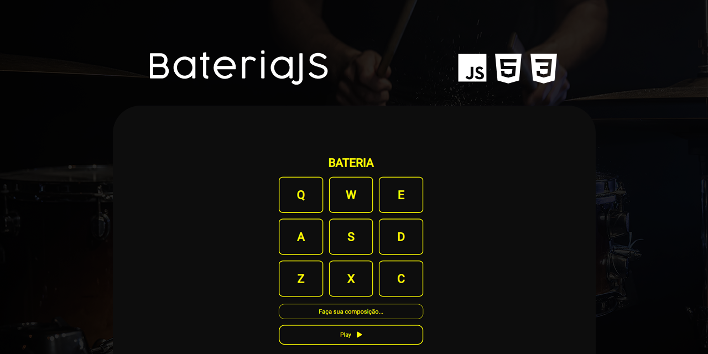

<div align="center" id="top"> 
  

&#xa0;

<a href="https://td-bateria-js.surge.sh/">Demo</a>

</div>

<h1 align="center">Bateria HtmlJS</h1>

<p align="center">
  

  

  

  

</p>

<p align="center">
  <a href="#dart-sobre">Sobre</a> &#xa0; | &#xa0; 
  <a href="#sparkles-funcionalidades">Funcionalidades</a> &#xa0; | &#xa0;
  <a href="#rocket-tecnologias">Tecnologias</a> &#xa0; | &#xa0;
  <a href="#white_check_mark-pré-requesitos">Pré requisitos</a> &#xa0; | &#xa0;
  <a href="#checkered_flag-começando">Começando</a> &#xa0; | &#xa0;
  <a href="#memo-licença">Licença</a> &#xa0; | &#xa0;
  <a href="https://github.com/thiilins" target="_blank">Autor</a>
</p>

<br>

## :dart: Sobre

Projeto desenvolvido para prática de manipulação de DOM usando Javascript.

## :sparkles: Funcionalidades

:heavy_check_mark: Reponsivo\
:heavy_check_mark: Reconhecimento de clique e Teclado;\
:heavy_check_mark: Gerador de Melodia;

## :rocket: Tecnologias

As seguintes ferramentas foram usadas na construção do projeto:

- HTML
- CSS
- JavaScript

## :white_check_mark: Pré requisitos

Antes de começar :checkered_flag:, você precisa ter o [Git](https://git-scm.com) e o [Node](https://nodejs.org/en/) instalados em sua maquina.

## :checkered_flag: Começando

```bash
# Clone este repositório
$ git clone https://github.com/thiilins/bateria-htmljs

# Entre na pasta
$ cd bateria-htmljs

#iniciar via live server

# O app vai inicializar em <http://localhost:8080>
```

## :memo: Licença

Este projeto está sob licença MIT. Veja o arquivo [LICENSE](LICENSE.md) para mais detalhes.

Feito com :heart: por <a href="https://github.com/thiilins" target="_blank">Thiago Lins</a>

&#xa0;

<a href="#top">Voltar para o topo</a>
