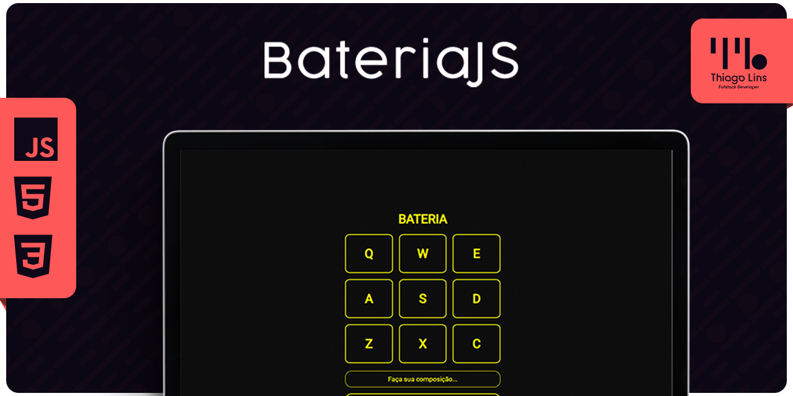

<div align="center" id="top">

[🇧🇷 Português](./README.md) | [🇺🇸 English](./README_EN.md) | [🇪🇸 Español](./README_ES.md)

</div>

# Bateria HtmlJS - [Arquivado]

<div align="center">



[Ver Demonstração](https://td-bateria-js.surge.sh/)


</div>

## 📖 Índice

- [Sobre o Projeto](#-sobre-o-projeto)
- [Funcionalidades](#-funcionalidades)
- [Tecnologias](#-tecnologias)
- [Pré requisitos](#-pré-requisitos)
- [Como Usar](#-como-usar)
- [Licença](#-licença)
- [Contato](#-contato)

## 📘 Sobre o Projeto

Projeto desenvolvido para prática de manipulação de DOM usando Javascript.

## 🚀 Funcionalidades

- **Reponsivo:** Adaptação para todos os dispositivos.
- **Reconhecimento:** Identifica cliques e teclas do teclado.
- **Gerador de Melodia:** Cria sequências melódicas.

## 🛠 Tecnologias

- HTML
- CSS
- JavaScript

## 📜 Pré-requisitos

Antes de começar, você precisa ter o [Git](https://git-scm.com) e o [Node](https://nodejs.org/en/) instalados em sua máquina.

## 🚀 Como Usar

```bash
# Clone este repositório:
git clone https://github.com/thiilins/bateriaJS.git

# Acesse o diretório do projeto:
cd bateriaJS

# Inicie via live server:
# O aplicativo será iniciado em: `http://localhost:8080`
```

## 📜 Licença

Este projeto está sob a licença MIT. Consulte o arquivo [LICENSE](./LICENSE.md) para obter mais detalhes.

## 📬 Contato

Feito com ❤️ por [Thiago Lins](https://github.com/thiilins). 
Para sugestões, feedback ou dúvidas, abra uma [issue](https://github.com/thiilins/bateriaJS/issues) ou entre em contato através do [perfil no GitHub](https://github.com/thiilins).
<p align="right">(<a href="#top">Voltar
