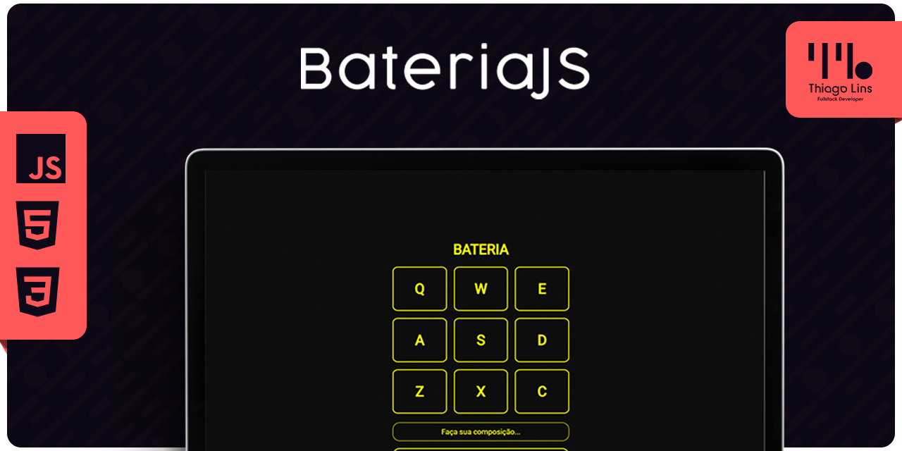

<div align="center" id="top">

[🇧🇷 Português](./README.md) | [🇺🇸 English](./README_EN.md) | [🇪🇸 Español](./README_ES.md)

</div>

# Batería HtmlJS - [Archivado]

<div align="center">



[Ver Demostración](https://td-bateria-js.surge.sh/)


</div>

## 📖 Índice

- [Acerca del Proyecto](#-acerca-del-proyecto)
- [Funcionalidades](#-funcionalidades)
- [Tecnologías](#-tecnologías)
- [Prerrequisitos](#-prerrequisitos)
- [Cómo Usar](#-cómo-usar)
- [Licencia](#-licencia)
- [Contacto](#-contacto)

## 📘 Acerca del Proyecto

Proyecto desarrollado para practicar la manipulación del DOM utilizando Javascript.

## 🚀 Funcionalidades

- **Responsivo:** Adaptado para todos los dispositivos.
- **Reconocimiento:** Identifica clics del ratón y teclas del teclado.
- **Generador de Melodía:** Crea secuencias melódicas.

## 🛠 Tecnologías

- HTML
- CSS
- JavaScript

## 📜 Prerrequisitos

Antes de comenzar, necesitas tener [Git](https://git-scm.com) y [Node](https://nodejs.org/es/) instalados en tu máquina.

## 🚀 Cómo Usar

```bash
# Clona este repositorio:
git clone https://github.com/thiilins/bateriaJS.git

# Accede al directorio del proyecto:
cd bateriaJS

# Inicia a través del servidor en vivo:
# La aplicación se iniciará en: `http://localhost:8080`
```

## 📜 Licencia

Este proyecto está bajo la Licencia MIT. Consulta el archivo [LICENSE](./LICENSE.md) para más detalles.

## 📬 Contacto

Hecho con ❤️ por [Thiago Lins](https://github.com/thiilins). 
Para sugerencias, comentarios o preguntas, abre una [issue](https://github.com/thiilins/bateriaJS/issues) o contacta a través del [perfil en GitHub](https://github.com/thiilins).
<p align="right">(<a href="#top">Volver al inicio</a>)</p>
